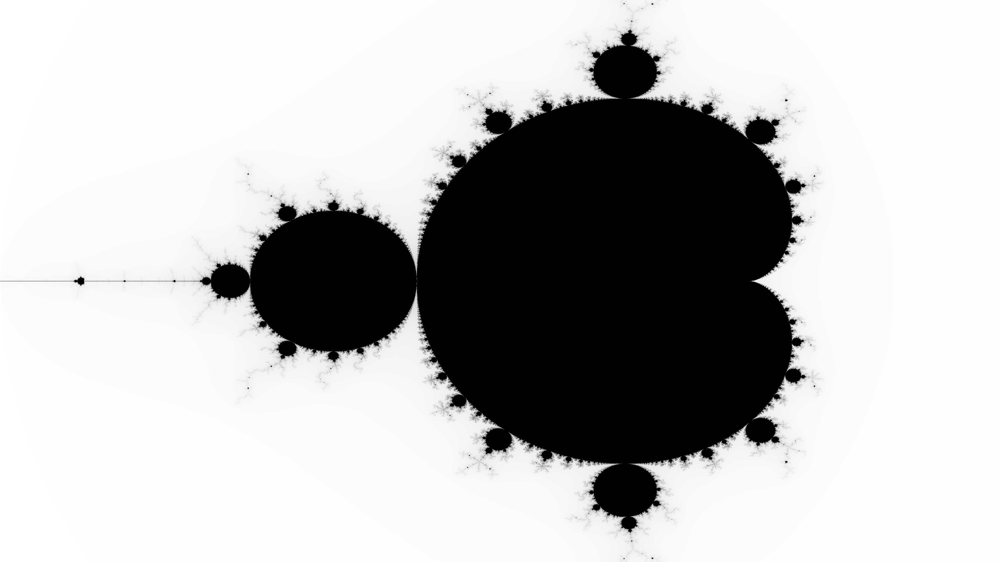

# Mandel

Two short Go programs that demonstrates the use of concurrency and goroutines for rendering a Mandelbrot fractal and a slice of a Mandelbulb fractal.

Only the Go standard library is used. Each row is rendered in a goroutine, where the function is called with the `go` keyword. `sync.WaitGroup` is used to wait for the gorutines to complete.

## Screenshots

### Mandelbrot



This image is rendered at 3840x2160 and takes around 2 seconds to render on my laptop.

### Mandelbulb


This image is rendered at 3840x2160 and then scaled down to 1920x1080. It takes around 12 seconds to render on my laptop.

## Source code

### Mandelbrot

```go
package main

import (
    "fmt"
    "image"
    "image/color"
    "image/png"
    "math/cmplx"
    "os"
    "sync"
)

const (
    width      = 3840
    height     = 2160
    xmin, ymin = -2, -1
    xmax, ymax = 1, 1
    maxIter    = 1000
)

var wg sync.WaitGroup

// mandelbrot calculates the color of a point in the Mandelbrot set.
func mandelbrot(c complex128) color.Color {
    z := c
    for i := 0; i < maxIter; i++ {
        if cmplx.Abs(z) > 2 {
            return color.Gray{uint8(255 - i%256)}
        }
        z = z*z + c
    }
    return color.Black
}

// renderRow renders a single row of the Mandelbrot set.
func renderRow(img *image.RGBA, y int) {
    defer wg.Done()
    for x := 0; x < width; x++ {
        c := complex(
            float64(x)/width*(xmax-xmin)+xmin,
            float64(y)/height*(ymax-ymin)+ymin)
        color := mandelbrot(c)
        img.Set(x, y, color)
    }
}

func main() {
    img := image.NewRGBA(image.Rect(0, 0, width, height))

    for y := 0; y < height; y++ {
        wg.Add(1)
        go renderRow(img, y)
    }

    wg.Wait()

    file, err := os.Create("mandelbrot.png")
    if err != nil {
        fmt.Println("Error creating file:", err)
        return
    }
    defer file.Close()

    err = png.Encode(file, img)
    if err != nil {
        fmt.Println("Error encoding image:", err)
    }
}
```

### Mandelbulb

```go
package main

import (
    "fmt"
    "image"
    "image/color"
    "image/png"
    "math"
    "os"
    "sync"
)

const (
    width, height      = 1920, 1080
    ssWidth, ssHeight  = 3840, 2160
    aspectRatio        = float64(ssWidth) / float64(ssHeight)
    fov                = math.Pi / 8
    maxIter            = 1000
    power              = 9
    escapeRadius       = 1.6
    supersamplingRatio = 2
)

var wg sync.WaitGroup

type vec3 struct{ x, y, z float64 }

func (v vec3) add(w vec3) vec3    { return vec3{v.x + w.x, v.y + w.y, v.z + w.z} }
func (v vec3) mul(s float64) vec3 { return vec3{v.x * s, v.y * s, v.z * s} }
func (v vec3) length() float64    { return math.Sqrt(v.x*v.x + v.y*v.y + v.z*v.z) }
func (v vec3) normalize() vec3    { return v.mul(1 / v.length()) }

func mandelbulb(p vec3) float64 {
    z, r, theta, phi := p, 0.0, 0.0, 0.0
    for i := 0; i < maxIter; i++ {
        r = z.length()
        if r > escapeRadius {
            break
        }
        theta, phi = math.Acos(z.z/r)*power, math.Atan2(z.y, z.x)*power
        r = math.Pow(r, power)
        z.x = p.x + r*math.Sin(theta)*math.Cos(phi)
        z.y = p.y + r*math.Sin(theta)*math.Sin(phi)
        z.z = p.z + r*math.Cos(theta)
    }
    return r
}

func renderPixel(x, y int) color.Color {
    px := (2*float64(x)/float64(ssWidth) - 1) * aspectRatio * math.Tan(fov/2)
    py := (1 - 2*float64(y)/float64(ssHeight)) * math.Tan(fov/2)
    direction := vec3{px, py, -1}.normalize()
    t := 0.0
    for i := 0; i < maxIter; i++ {
        p := direction.mul(t).add(vec3{0, 0, 5})
        d := mandelbulb(p) - 1
        if d < 0.001 {
            return color.Gray{uint8(255 - t*255/100)}
        }
        t += d
        if t > 100 {
            break
        }
    }
    return color.Black
}

func main() {
    ssImg := image.NewRGBA(image.Rect(0, 0, ssWidth, ssHeight))
    for y := 0; y < ssHeight; y++ {
        wg.Add(1)
        go func(y int) {
            defer wg.Done()
            for x := 0; x < ssWidth; x++ {
                ssImg.Set(x, y, renderPixel(x, y))
            }
        }(y)
    }
    wg.Wait()

    img := image.NewRGBA(image.Rect(0, 0, width, height))
    for y := 0; y < height; y++ {
        for x := 0; x < width; x++ {
            r, g, b, a := 0, 0, 0, 0
            for dy := 0; dy < supersamplingRatio; dy++ {
                for dx := 0; dx < supersamplingRatio; dx++ {
                    c := ssImg.RGBAAt(x*supersamplingRatio+dx, y*supersamplingRatio+dy)
                    r += int(c.R)
                    g += int(c.G)
                    b += int(c.B)
                    a += int(c.A)
                }
            }
            r /= supersamplingRatio * supersamplingRatio
            g /= supersamplingRatio * supersamplingRatio
            b /= supersamplingRatio * supersamplingRatio
            a /= supersamplingRatio * supersamplingRatio
            img.Set(x, y, color.RGBA{uint8(r), uint8(g), uint8(b), uint8(a)})
        }
    }

    file, err := os.Create("mandelbulb.png")
    if err != nil {
        fmt.Println("Error creating file:", err)
        return
    }
    defer file.Close()
    err = png.Encode(file, img)
    if err != nil {
        fmt.Println("Error encoding image:", err)
    }
}
```

## General info

* Author: Alexander F. Rødseth
* Assistant: GPT4
* License: CC0
* Version: 0.0.1
