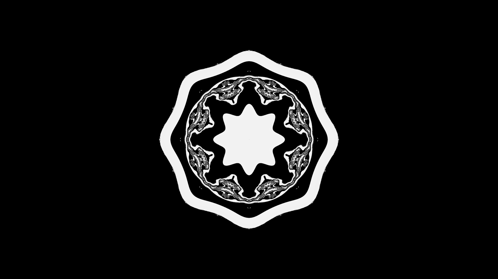

# Mandel

Two example Go programs that demonstrates the use of concurrency and goroutines for rendering a mandelbrot fractal and a slice of a mandelbulb fractal.

## Screenshots

### Mandelbrot

### Mandelbulb

## General info

* Author: Alexander F. Rødseth
* Assistant: GPT4
* License: CC0
* Version: 0.0.1
